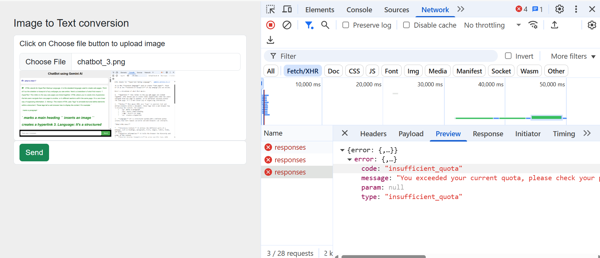
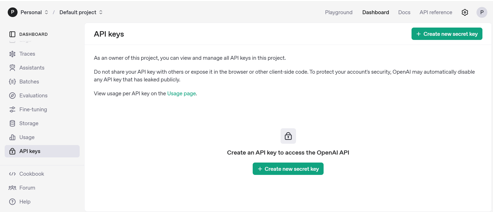

# Open AI Chat GPT Integration with Angular Application
In order to use ChatGPT in an Angular app, you must first set up a backend server that communicates with the ChatGPT API because ChatGPT is a pre-trained model that runs on a server. Any server-side language, including Node.js, Python, or Go, can be used to accomplish this.

Another way of integrating Chat GPT in angular app is to use npm package named ![openai]<https://www.npmjs.com/package/openai>.

https://platform.openai.com/docs/models  
https://platform.openai.com/docs/overview  
https://platform.openai.com/docs/quickstart?api-mode=responses  

## is openai api key free ?
No, an OpenAI API key is not free. While you can create an API key for free, you will need to purchase credits to use the API. OpenAI operates on a pay-as-you-go system, where you pay for the tokens (or data) used by the API. There may be promotional credits offered for a limited time, but these are not the norm. 


## How to Generate a OpenAI API Key: Step-by-Step Guide
To obtain an OpenAI API key, first create an OpenAI account and navigate to the API section on the platform, then generate a new secret key. You can find the API key generation option in the API section, often under a "Personal" or "API keys" menu. After generating the key, store it securely, as you'll need it for accessing OpenAI's services. 
https://platform.openai.com/  
https://www.youtube.com/watch?v=eRWZuijASuU   



***src\environments\environment.ts***
    export const environment = {
      production: true,
      API_KEY: '', // Generate Google Gemini API Key using your gmail account
    };

***src\environments\environment.development.ts***
    export const environment = {
      production: false,
      API_KEY: '',  // Generate Google Gemini API Key using your gmail account
    };

## Install open ai package using npm
In your Angular project, install the open ai package using npm:

     npm i openai — save

## Create an Angular Service for Gemini API Interaction:
Generate a new service using the Angular CLI:

     ng generate service openai

In this service, import the OpenaiAI client and initialize it with your API key.
Implement methods within the service to handle different Gemini functionalities, such as:
Text generation: Sending text prompts to the model and receiving text responses.

```
export class OpenaiService {
  openaiApiConfig = inject(OPENAI_API_CONFIG);
  openAI!: OpenAI;
  loadingService = inject(LoadingService);

  constructor() {
    this.checkConfig();
  }
  checkConfig() {
    if (this.openAI) {
      return;
    }
    if (!this.openaiApiConfig.apiKey) {
      throw new Error('Openai Api Key not provided');
    }
    if (!this.openaiApiConfig.model) {
      throw new Error('Openai model not provided');
    }
    /*
    ERROR OpenAIError: It looks like you're running in a browser-like environment.

    This is disabled by default, as it risks exposing your secret API credentials to attackers.
    If you understand the risks and have appropriate mitigations in place,
    you can set the `dangerouslyAllowBrowser` option to `true`, e.g.,

    new OpenAI({ apiKey, dangerouslyAllowBrowser: true });

    https://help.openai.com/en/articles/5112595-best-practices-for-api-key-safety
    */
    this.openAI = new OpenAI({
      apiKey: this.openaiApiConfig.apiKey, // This is the default and can be omitted
      dangerouslyAllowBrowser: true // run with insecure browser
    });
  }

  async generateTextFromImg(prompt: string, base64Image: any, mimeType: any) {
    try {
      this.checkConfig();
      // const requestData={
      //     model: this.openaiApiConfig.model,
      //     prompt: prompt,
      //     temperature: 0.95,
      //     max_tokens: 150,
      //     top_p: 1.0,
      //     frequency_penalty: 0.0,
      //     presence_penalty: 0.0,
      //     stream: false
      //   };
      const result = await this.openAI.responses.create({
        model: this.openaiApiConfig.model,
        instructions: prompt,
        input: 'Are semicolons optional in JavaScript?',
      });
      // const text = this.formatText(result.response.text());
      console.log('result => ', result);
      this.loadingService.loadingOff();
    } catch (error) {
      console.error("An error occurred:", error);
      this.loadingService.loadingOff();
    }
    return '';
  }

  formatText(text: string) {
    return text.replace('\n', '<br/>').replace('*   **', '<b>').replace(':**', '</b>');
  }
}
```
